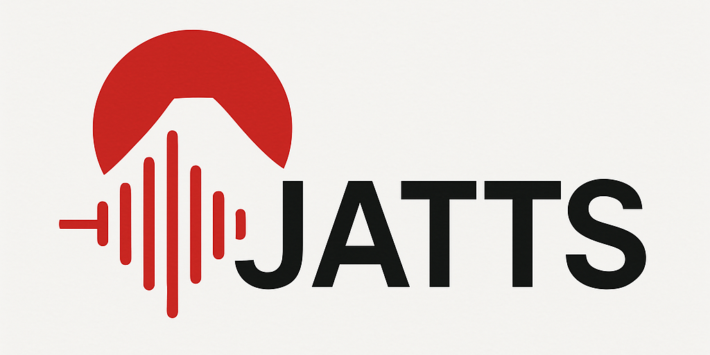

  

# JATTS：日本語テキスト音声合成における手法比較に向けたオープンツールキット

### JATTS: A modern, research-oriented Japanese Text-to-speech Open-sourced Toolkit

## Acknowledgements

This repo is greatly inspired by the following repos. Or I should say, many code snippets are directly taken from part of the following repos.

- [ESPNet](https://github.com/espnet/espnet)
- [ParallelWaveGAN](https://github.com/kan-bayashi/ParallelWaveGAN/)

## Author

Wen-Chin Huang  
Toda Labotorary, Nagoya University  
E-mail: wen.chinhuang@g.sp.m.is.nagoya-u.ac.jp
